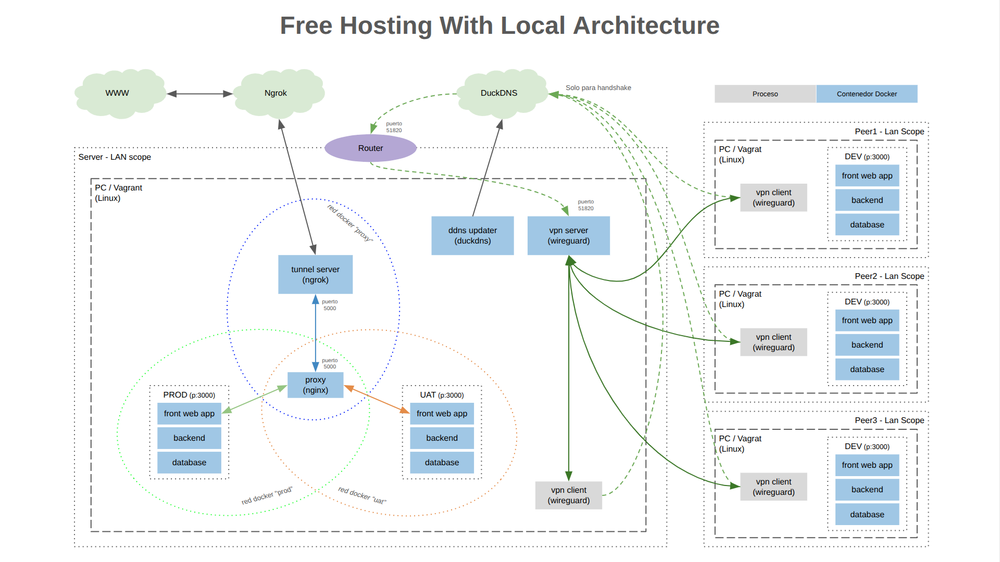

# :globe_with_meridians: Hosting gratis con arquitectura local

### :scroll: Vista General

El proyecto tiene como objetivo facilitar el despliegue de un entorno para hosting y desarrollo de aplicaciones web utilizando herramientas gratuitas en un entorno local.

- [Arquitectura](#arquitectura)
- [Pre-requisitos](docs/pre-requisitos.md)
- [Instalación y uso](docs/instalacion-y-uso.md)
- [Desarrollo](docs/desarrollo.md)

---

### Arquitectura

##### Componentes:

- **VPN Server** (_[Wireguard](https://www.wireguard.com/)_)

  Tiene como objetivo crear una red privada para que tanto el servidor host de la arquitectura ("Server" en la imagen) como los peers utilizados para desarrollar sobre la aplicación web se puedan conectar entre sí.

######

- **DDNS Updater** (_[DuckDNS](https://www.duckdns.org/)_)

  Tiene como objetivo otorgar un dominio "estático" al servidor host de la arquitectura para que pueda ser accedido sin importar si su IP es estática o dinámica. Principalmente utilizado para handshake entre los peers y el **_"VPN Server"_**. Utiliza

######

- **Tunnel Server** (_[Ngrok](https://ngrok.com/)_)

  Tiene como objetivo dar un dominio "estático" para exponer la aplicación web en internet.

######

- **Proxy** (_[Nginx](https://nginx.org/)_)

  Tiene como objetivo poder disponibilizar más de un entorno de la aplicación web (producción y uat en la imagen).

######

- **Server/Nodo (opcional)** (_[Vagrant](https://developer.hashicorp.com/vagrant)_)

  Vagrant es una máquina virtual, este componente del proyecto no es requerido pero sí recomendado para aquellos que quieran tener un entorno aislado o para usuarios de Windows, ya que la solución está pensada para entornos Linux.

---

# [➡︎](docs/pre-requisitos.md)
